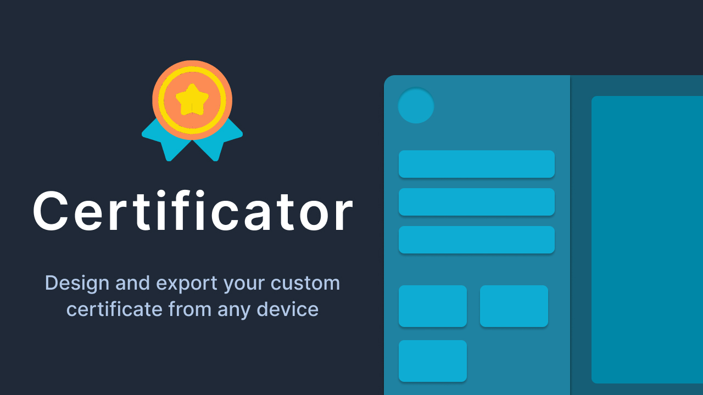

<p align="center">
  
</p>

## Features

- Choose from existing presets
- Upload your custom designs
- Edit receiver information
- Drag and position the text
- Export to PDF
- Responsive design

## Stack

- Next.js `11.x`
- React `17.x`
- Tailwind CSS `2.x`

## Requirements

- Node.js `14.x`

## Getting started

1. Install Node.js dependencies:

```sh
yarn
```

2. Create a MongoDB database. You can host it yourself or use [MongoDB Atlas](https://docs.atlas.mongodb.com/getting-started/).

3. Copy the connection string. (eg. `mongodb+srv://<username>:<password>@clustername.mongodb.net/dbname`)

4. Add this environment variable with the connection string in the `.env.local` file or on your server.

```sh
MONGODB_URI=
```

## Development

**Start the local development server**

```sh
yarn dev
```

Open http://localhost:3000 in your browser.

## Credits

Logo made by [Freepik](https://www.freepik.com) from [www.flaticon.com](https://www.flaticon.com)
